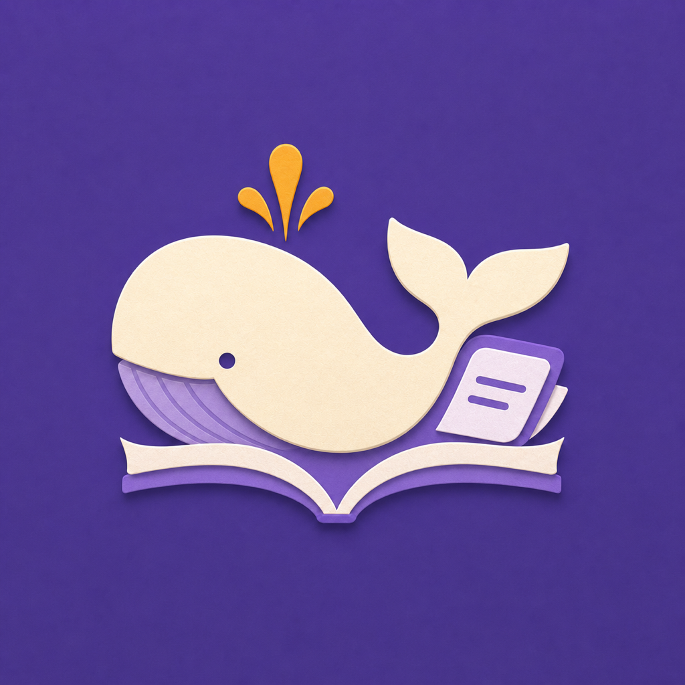
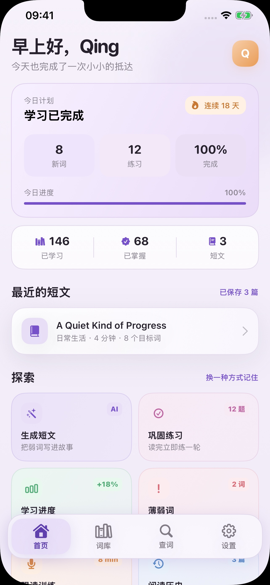
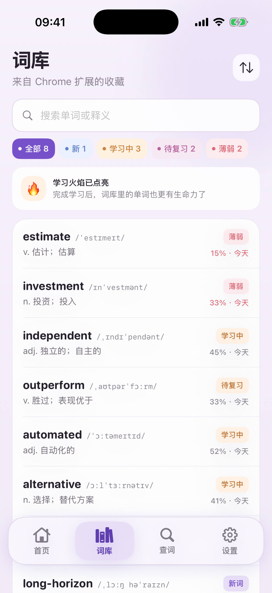
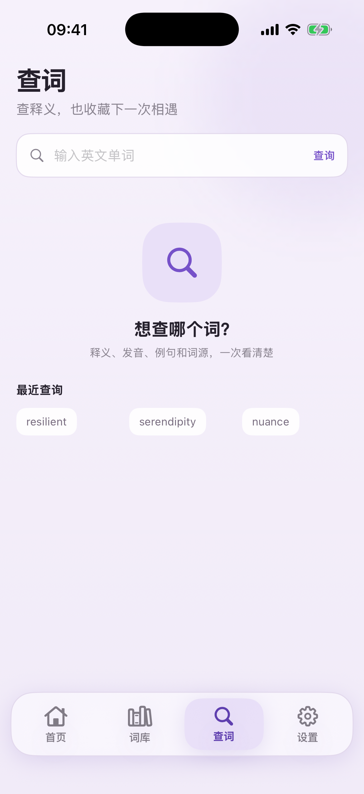
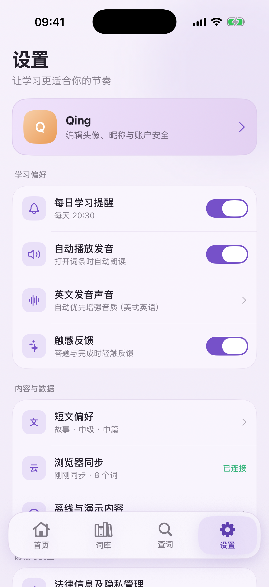
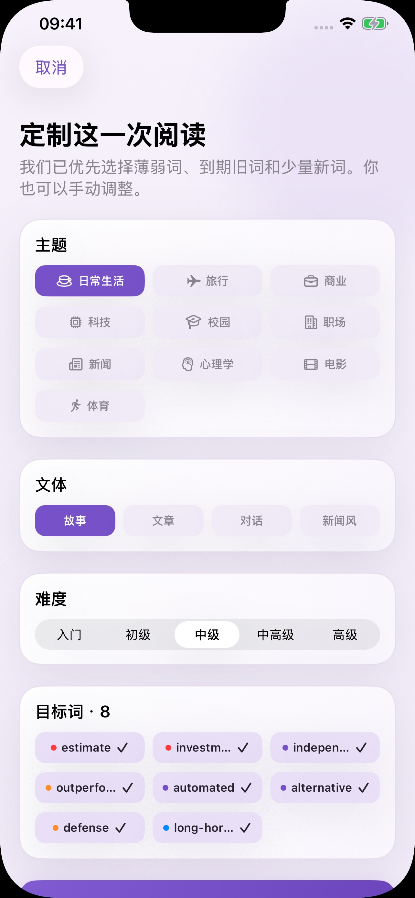
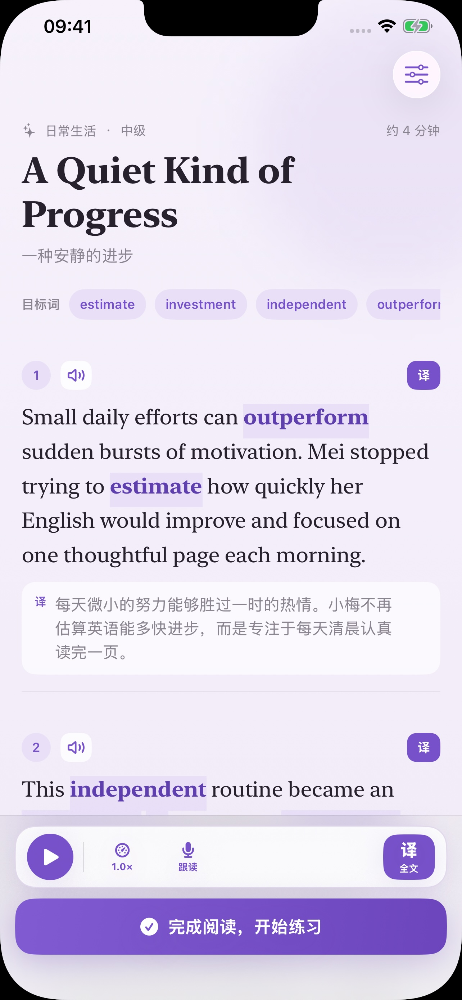
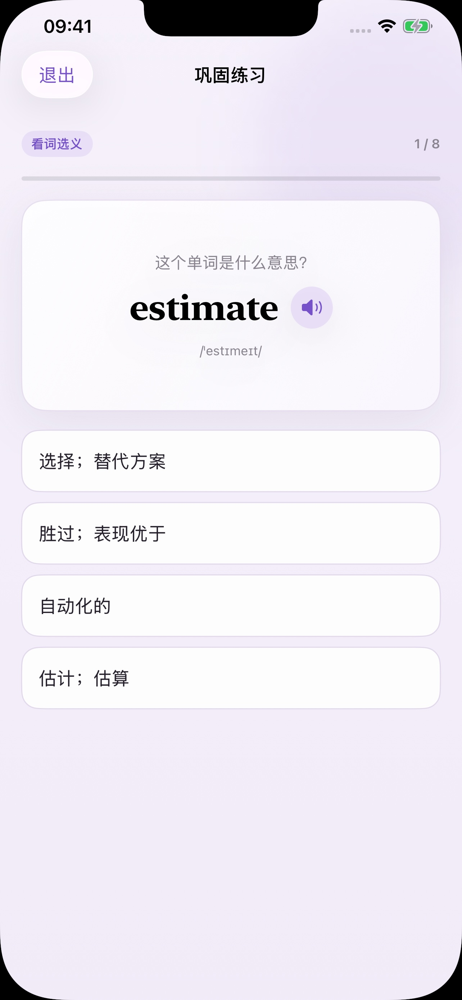
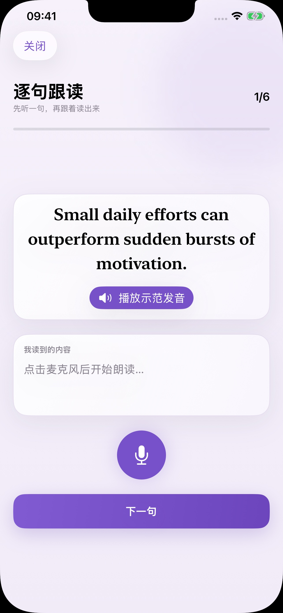
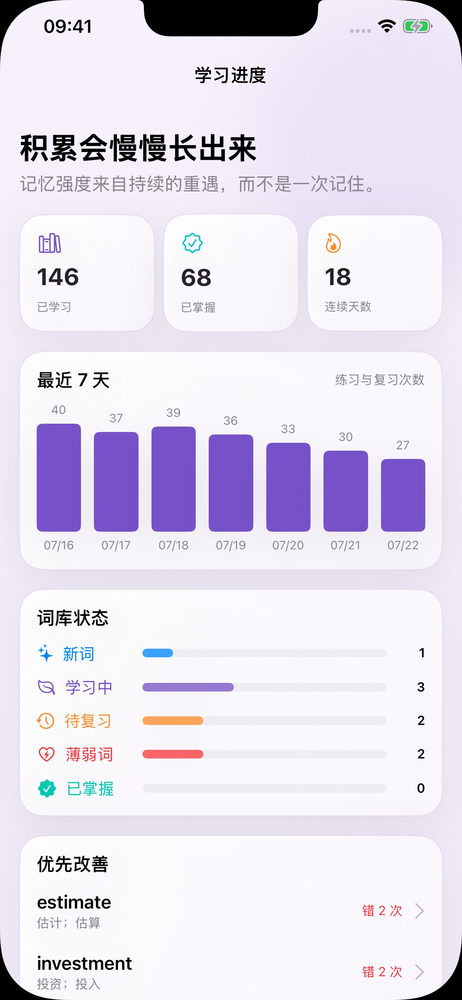

# 词鲸背单词 · CiJing

<p align="center">
  
</p>

<p align="center">
  把真实阅读中遇见的单词，变成个人词库、AI 分级短文和可持续的间隔复习。
</p>

<p align="center">
  <a href="README.md">English</a> ·
  <a href="docs/DEVELOPMENT.md">开发指南</a> ·
  <a href="docs/ARCHITECTURE.md">架构说明</a> ·
  <a href="docs/PRODUCTION.md">生产部署</a> ·
  <a href="docs/APP_STORE_CHECKLIST_zh.md">App Store 清单</a>
</p>

<p align="center">
  
  
  
  
</p>

## 页面展示

软件只有首页、词库、查词和设置四个一级页面。首页把今日计划、累计成果、持久化短文记录和真实可用的学习入口集中在一屏，信息更完整，也能直接继续上一次学习。

<p align="center">
  
</p>

### 四个一级页面

<table>
  <tr>
    <td align="center"><strong>首页</strong><br><sub>今日计划、可持久化的短文记录与练习入口</sub></td>
    <td align="center"><strong>词库</strong><br><sub>学习状态、熟练度、复习时间与语境单词</sub></td>
  </tr>
  <tr>
    <td align="center"></td>
    <td align="center"></td>
  </tr>
  <tr>
    <td align="center"><strong>查词</strong><br><sub>释义、发音、例句与一键收藏</sub></td>
    <td align="center"><strong>设置</strong><br><sub>学习偏好、隐私管理、缓存与账户</sub></td>
  </tr>
  <tr>
    <td align="center"></td>
    <td align="center"></td>
  </tr>
</table>

### 完整学习过程

一级导航保持克制，进入学习后形成完整闭环：选词定制短文、双语阅读、语境练习、逐句跟读，再回到进度页查看积累。以下全部是 App 内真实页面，不是概念图。

<table>
  <tr>
    <td align="center"><strong>1 · 选词定制</strong><br><sub>主题、文体、难度和目标词</sub></td>
    <td align="center"><strong>2 · 双语阅读</strong><br><sub>目标词高亮，翻译可按段展开</sub></td>
    <td align="center"><strong>3 · 巩固练习</strong><br><sub>词义、语境、拼写与主动回忆</sub></td>
  </tr>
  <tr>
    <td align="center"></td>
    <td align="center"></td>
    <td align="center"></td>
  </tr>
  <tr>
    <td align="center"><strong>4 · 逐句跟读</strong><br><sub>听一句、读一句、查看匹配反馈</sub></td>
    <td align="center"><strong>5 · 查看成长</strong><br><sub>活跃趋势、词库状态与薄弱词</sub></td>
    <td align="center"><strong>学习闭环</strong><br><sub>收藏 → 阅读 → 练习 → 重遇</sub></td>
  </tr>
  <tr>
    <td align="center"></td>
    <td align="center"></td>
    <td align="center">已生成短文长期保存，重启或重新登录后仍可继续</td>
  </tr>
</table>

## 核心能力

- 通过 Chrome Manifest V3 扩展收藏网页单词和首次出现的语境。
- 维护用户私有词库、学习状态、笔记、熟练度和下一次复习时间。
- 从薄弱词、到期词和新词中选择目标词，生成自然连贯的双语分级短文。
- 每篇生成内容都写入 `reading_sessions`，重启 App 或重新登录后仍可从首页继续阅读。
- 使用熟练度、易度系数、间隔、遗忘次数与到期时间安排复习。
- 支持系统发音、跟读和基于短文的练习闭环。
- 所有用户数据均由 Supabase Row Level Security 按账号隔离。

## 仓库结构

```text
.
├── client/      # SwiftUI iOS App
├── extension/   # Chrome 双击查词与收藏扩展
├── supabase/    # PostgreSQL 迁移、RLS、RPC 与 Edge Functions
├── server/      # 可信 Flask 服务边界与健康检查
├── scripts/     # 配置、审计与冒烟测试脚本
├── docs/        # 开发、架构、生产部署与商店素材
└── website/     # 对外托管的隐私政策与支持页面
```

iOS App 和扩展通过 Supabase Auth 与 PostgREST 共享账号和学习数据；通过身份校验的 Edge Functions 调用所配置的 OpenRouter 模型生成词义解释和分级短文。服务端密钥与 AI 服务密钥不会进入客户端安装包。

## 快速开始

需要 macOS、Xcode 16 或更新版本、Node.js 20+、Docker Desktop 和 Chrome。

```bash
cp .env.example .env
# 在 .env 中填写当前环境变量
make config

./scripts/supabase.sh start
./scripts/supabase.sh db reset
make functions
```

用 Xcode 打开 `client/CiJing.xcodeproj`，选择 `CiJing` scheme 和 iOS 17+ 模拟器运行。Chrome 扩展可在 `chrome://extensions` 中选择“加载已解压的扩展程序”，然后载入 `extension/`。

## 验证

```bash
make config-check
make extension-test
make server-test
make ios-build
```

本地 Supabase 启动后可运行 `make smoke` 验证跨端 API 流程；生产部署完成后可运行 `make production-audit` 与 `make production-smoke`。

## 参与贡献与安全

提交贡献前请阅读 [CONTRIBUTING.md](CONTRIBUTING.md) 与 [CODE_OF_CONDUCT.md](CODE_OF_CONDUCT.md)。发现安全问题时请按照 [SECURITY.md](SECURITY.md) 私下报告，不要创建公开 Issue。

本项目采用 [MIT License](LICENSE)。
